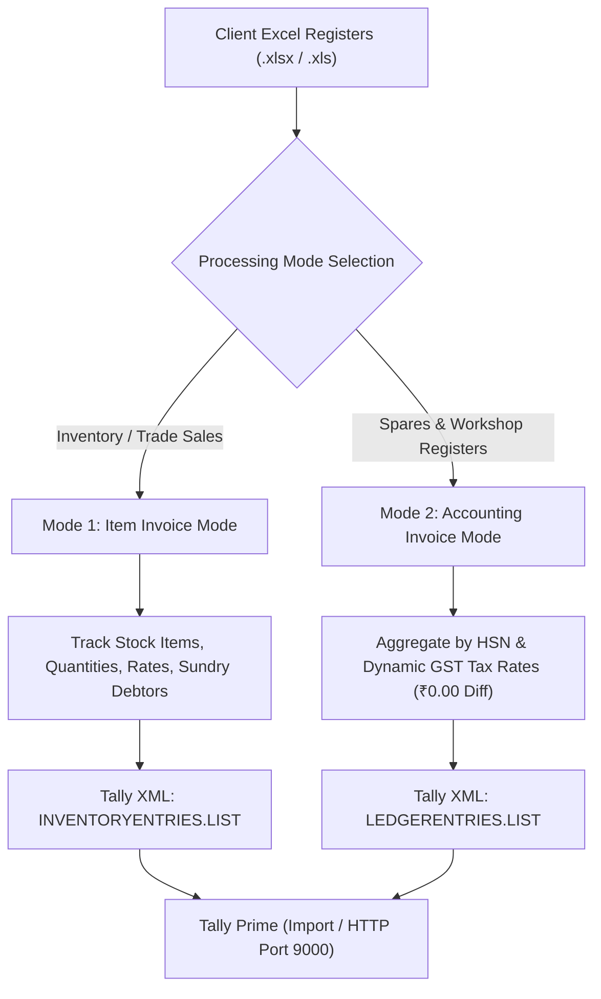
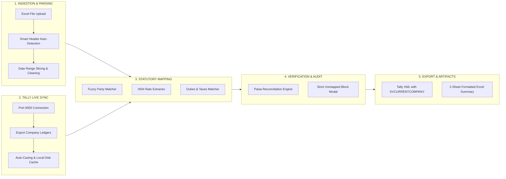
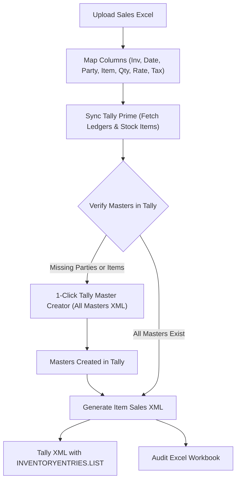
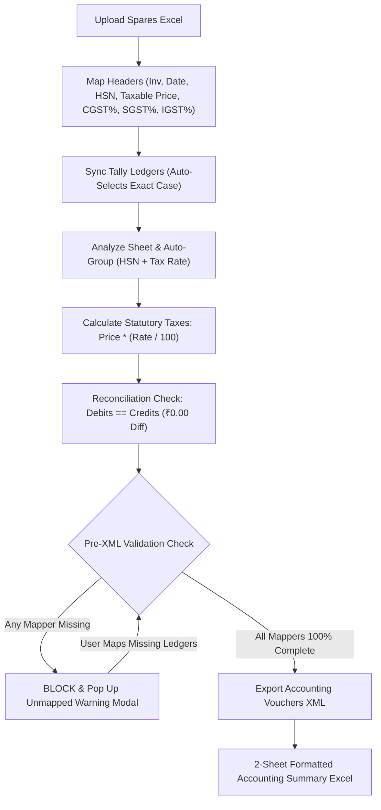
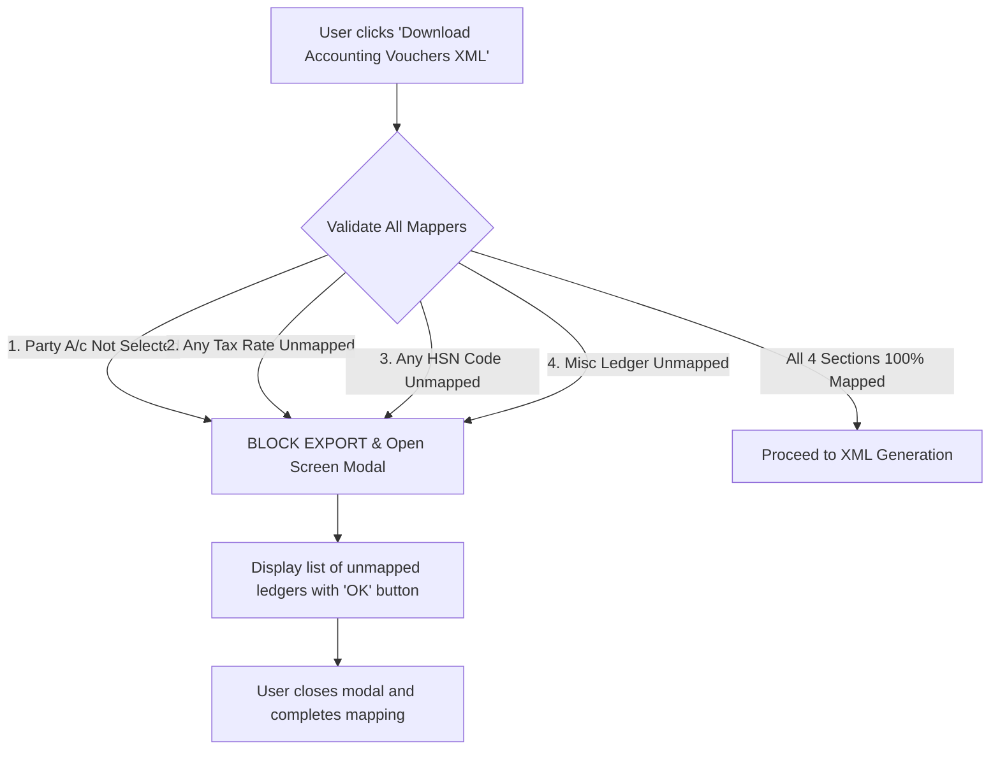

# SALES2TALLY — Enterprise Sales & Purchase Registers Automation Suite

[](LICENSE)
[](https://www.python.org/)
[](https://flask.palletsprojects.com/)
[](https://tallysolutions.com/)
[]()
[]()

> [!CAUTION]
> **PROPRIETARY & CONFIDENTIAL SOURCE-AVAILABLE REPOSITORY**  
> This repository is **NOT open-source software**. Access to view this code is granted strictly for personal, educational code review, security audit, and evaluation purposes only. Copying, cloning, modifying, redistributing, or unauthorized commercial exploitation is strictly prohibited without prior express written permission from **Venu Kumar**. See the full [`LICENSE`](LICENSE) for details.

**SALES2TALLY** is an enterprise-grade automation platform designed for chartered accountants, tax consultants, automobile dealerships, and service centers. It converts complex external sales and purchase spreadsheets (`.xlsx`, `.xls`) into fully validated, paisa-balanced **Tally Prime XML vouchers** and formatted audit summary workbooks.

---

## Table of Contents
1. [Core Sales Modes Overview](#core-sales-modes-overview)
2. [Mode Comparison: Item Invoice vs. Accounting Invoice](#mode-comparison-item-invoice-vs-accounting-invoice)
3. [Architecture & Workflow Diagrams](#architecture--workflow-diagrams)
4. [Mode 1: Item Invoice Workflow (Inventory-Driven)](#mode-1-item-invoice-workflow-inventory-driven)
5. [Mode 2: Accounting Invoice Workflow (HSN Spares & Services)](#mode-2-accounting-invoice-workflow-hsn-spares--services)
6. [Statutory Tax Engine & Decimal Rate Support](#statutory-tax-engine--decimal-rate-support)
7. [Paisa-Accurate Round-Off Engine (Misc Round Up / Down / Net)](#paisa-accurate-round-off-engine)
8. [Strict Ledger Validation & Tally Safeguards](#strict-ledger-validation--tally-safeguards)
9. [Project Directory Structure](#project-directory-structure)
10. [Build & Packaging Pipeline](#build--packaging-pipeline)

---

## Core Sales Modes Overview

SALES2TALLY provides two dedicated, isolated processing pipelines designed to address distinct commercial accounting requirements in Tally Prime:



---

## Mode Comparison: Item Invoice vs. Accounting Invoice

| Feature / Dimension | Mode 1: Item Invoice Mode | Mode 2: Accounting Invoice Mode |
| :--- | :--- | :--- |
| **Primary Target** | Dealership vehicle sales, trading goods, retail items | Spares registers, workshop job cards, service billing |
| **Inventory Tracking** | **Yes** — tracks Stock Item names, quantities, units, rates | **No** — pure financial accounting without item masters |
| **Voucher Aggregation** | Grouped by Invoice No with item-by-item breakdown | Grouped by Invoice No, aggregated by **HSN Code + GST Rate** |
| **Tally XML Structure** | `<INVENTORYENTRIES.LIST>` with `<ACCOUNTINGALLOCATIONS.LIST>` | `<LEDGERENTRIES.LIST>` directly credited to Spares Ledgers |
| **Tally Persisted View** | `Invoice Voucher View` / `Accounting Voucher View` | `Invoice Voucher View` |
| **Tax Calculation** | Extracted from row columns or mapped tax percentages | Statutory formula: `Selling Price * (Rate / 100.0)` |
| **Decimal Tax Rates** | Whole numbers (`5%`, `12%`, `18%`, `28%`) | **Full Floating-Point Support** (`2.5%`, `1.5%`, `0.75%`, `0.25%`, `9.0%`) |
| **Spares Ledger Pattern** | Standard Sales account (e.g. `Sales Account`) | Dynamic Pattern: `Gst Spares {CombinedRate}%-{HSN}` |
| **Master Creation** | Auto-creates missing Stock Items and Sundry Debtors in Tally | Maps to existing Tally Spares & Tax accounts |
| **Validation Safety** | Party & stock item verification reports | **Strict Pre-XML Modal**: blocks export if any mapper is missing |
| **Misc Offset Tracking** | Single net round-off entry | **3-Row Breakdown**: Misc Round Up (+), Down (-), and Net Misc |

---

## Architecture & Workflow Diagrams

### End-to-End Processing Architecture



---

## Mode 1: Item Invoice Workflow (Inventory-Driven)

Mode 1 is designed for sales operations where tracking physical inventory quantities, units of measurement, and item descriptions is required.



### Key Capabilities in Item Invoice Mode:
- **Inventory Entries Hierarchy:** Wraps each physical product in `<INVENTORYENTRIES.LIST>` containing `<STOCKITEMNAME>`, `<RATE>`, `<ACTUALQTY>`, and `<BILLEDQTY>`.
- **Accounting Allocations:** Sub-allocates each stock item to designated sales and tax accounts via `<ACCOUNTINGALLOCATIONS.LIST>`.
- **Fuzzy Party Matching:** Matches raw customer strings against Tally Sundry Debtors using normalized tokenized Jaccard similarity ($\ge 0.60$).
- **One-Click Master Creator:** Generates and executes Tally `All Masters` XML envelopes to instantly create missing Sundry Debtors and Stock Items directly in Tally Prime.

---

## Mode 2: Accounting Invoice Workflow (HSN Spares & Services)

Mode 2 is designed for automotive service centers, spare parts registers, and workshop billing where thousands of line items must be booked directly to statutory HSN accounts without maintaining individual stock quantities.



### Key Capabilities in Accounting Invoice Mode:
- **HSN Spares Aggregation:** Combines multiple line items sharing the same HSN code and total tax rate into a single statutory credit entry (e.g. `Gst Spares 18%-87141090`).
- **Zero Inventory Master Bloat:** Creates clean accounting vouchers without polluting Tally's item master list with single-use part numbers.
- **Invoice Voucher View:** Enforces `<PERSISTEDVIEW>Invoice Voucher View</PERSISTEDVIEW>` and `<LEDGERENTRIES.LIST>` to ensure statutory GST compliance and clean display in Tally.

---

## Statutory Tax Engine & Decimal Rate Support

In commercial dealership registers, taxes can contain pure integers (`9%`, `14%`), float representations of whole numbers (`9.0`, `18.0`), and genuine decimal tax rates (`2.5%`, `1.5%`, `0.75%`, `0.25%`).

SALES2TALLY uses a specialized statutory tax engine:

```python
def to_rate_float(val):
    """Safely converts numeric cell values to float without truncation."""
    if val is None or pd.isna(val):
        return 0.0
    try:
        return float(val)
    except (ValueError, TypeError):
        return 0.0

def format_rate_str(rate):
    """
    Formats whole-number floats cleanly (e.g. 9.0 -> '9', 18.0 -> '18')
    while preserving true floating points (e.g. 2.5 -> '2.5', 0.25 -> '0.25').
    """
    if rate is None:
        return "0"
    r = float(rate)
    if r.is_integer():
        return str(int(r))
    return str(r)
```

### Supported Combinations Matrix:
- **Different Integers:** `CGST 9%` + `SGST 14%` $\rightarrow$ Spares: **`23%`** (`Gst Spares 23%-{HSN}`)
- **Integer + Decimal:** `CGST 9%` + `SGST 2.5%` $\rightarrow$ Spares: **`11.5%`** (`Gst Spares 11.5%-{HSN}`)
- **Different Decimals:** `CGST 0.75%` + `SGST 1.5%` $\rightarrow$ Spares: **`2.25%`** (`Gst Spares 2.25%-{HSN}`)
- **Decimals Summing to Whole Number:** `CGST 2.5%` + `SGST 2.5%` = `5.0%` $\rightarrow$ Clean whole number: **`5%`** (`Gst Spares 5%-{HSN}`)
- **Float Whole Numbers:** `CGST 9.0%` + `SGST 6.0%` = `15.0%` $\rightarrow$ Clean whole number: **`15%`** (`Gst Spares 15%-{HSN}`)
- **Inter-State IGST:** Full support for single-rate inter-state transactions (`18%`, `0.25%`, `5%`, `12%`).

---

## Paisa-Accurate Round-Off Engine

Each commercial invoice rounds line items mathematically to the whole rupee. Over thousands of rows, cumulative paisa discrepancies arise between the sum of line credits and the rounded invoice total.

SALES2TALLY balances every voucher to **exact ₹0.00 difference**:

$$\text{Gross Sum} = \text{Taxable Price} + \text{CGST} + \text{SGST} + \text{IGST}$$
$$\text{Rounded Total} = \text{round\_half\_up}(\text{Gross Sum})$$
$$\text{Misc Offset} = \text{Rounded Total} - (\text{Price} + \text{CGST} + \text{SGST} + \text{IGST})$$

### 3-Row Misc Verification Breakdown:
In Step 4 of the user interface, the round-off is transparently audited:

1. **`Misc Round Up (+)`** (Greyed-out label, **Green Amount**):  
   Sum of all positive invoice offsets where the total was rounded up.
2. **`Misc Round Down (-)`** (Greyed-out label, **Red Amount with `-` sign**):  
   Sum of all negative invoice offsets where the total was rounded down.
3. **`Net Misc / Round-off`** (Greyed-out label, **Dynamically Colored Amount**):  
   The algebraic net: $\text{Round Up} - \text{Round Down}$. Green if $\ge 0$, Red if $< 0$.
4. **Reconciliation Formula:**  
   $$\text{Selling Price} + \text{CGST} + \text{SGST} + \text{IGST} + \mathbf{Net\ Misc} = \mathbf{Grand\ Total}$$
   *(Zero double-counting: only the Net Misc is included in the bottom grand total).*

---

## Strict Ledger Validation & Tally Safeguards

To prevent Tally import runtime exceptions (e.g. `Ledger 'Cgst 2.5% Output' does not exist`), SALES2TALLY includes a strict pre-flight validator:



### Company Name Auto-Discovery:
- **Case-Insensitive Match:** When connecting to Tally on Port 9000, typing `dvs test` automatically queries Tally Prime and replaces it with Tally's exact official name: **`Dvs Test`**.
- **SVCURRENTCOMPANY Tag:** Every generated XML writes `<SVCURRENTCOMPANY>Dvs Test</SVCURRENTCOMPANY>`, ensuring that Tally routes vouchers strictly to the intended company without cross-contamination.

---

## Project Directory Structure

```text
Sales & Purchase Registers/
├── app.py                             # Core server & window launcher
├── config.py                          # App configuration, base paths, target columns
├── build_pipeline.py                  # PyArmor + PyInstaller + Inno Setup build script
├── installer_setup.iss                # Inno Setup Windows installer compiler script
│
├── accounting_voucher/                # Mode 2: Accounting Invoice Subsystem
│   ├── routes.py                      # Accounting mode API blueprint endpoints
│   └── services/
│       ├── analysis_service.py        # HSN & decimal rate analyzer with fuzzy ledger matcher
│       ├── xml_generator.py           # Vouchers XML generator with ₹0.00 balancing & SVCURRENTCOMPANY
│       ├── excel_generator.py         # 2-sheet formatted summary Excel workbook (XlsxWriter)
│       └── tally_service.py           # Port 9000 live TDL connector & local company disk cache
│
├── services/                          # Mode 1: Item Invoice Subsystem
│   ├── tally_ledger_service.py        # Port 9000 ledger sync & company cache
│   ├── tally_stock_service.py         # Port 9000 stock items sync & cache
│   ├── master_creator.py              # Missing Sundry Debtors & Stock Items creator XML
│   ├── xml_generator.py               # Item-based sales vouchers XML generator
│   └── excel_generator.py             # Item-based audit summary Excel generator
│
├── routes/                            # Mode 1: API Blueprints
│   ├── main_routes.py                 # File upload, headers detection, and downloads
│   ├── tally_routes.py                # Mode 1 Tally sync and master creation
│   ├── analysis_routes.py             # Party & product verification reports
│   └── generator_routes.py            # XML & Excel triggers
│
├── templates/
│   ├── base.html                      # Layout shell, headers, and navigation
│   ├── index.html                     # Mode 1: Item Invoice UI
│   └── accounting_section.html        # Mode 2: Accounting Invoice UI & Modals
│
└── static/
    ├── style.css                      # Unified modern dark theme stylesheet
    └── js/
        ├── accounting.js              # Mode 2: Accounting wizard, mapper validation, and XML trigger
        ├── main.js                    # Mode 1: Main entry point
        ├── mapping.js                 # Mode 1: Header mapping grid
        ├── tally.js                   # Mode 1: Tally sync controller
        └── verification.js            # Mode 1: Party and stock verification
```

---

## Build & Packaging Pipeline

SALES2TALLY includes a fully automated 4-stage build pipeline:

```powershell
python build_pipeline.py
```

1. **Clean:** Wipes `build/`, `dist/`, and `dist_obf/`.
2. **PyArmor Obfuscation:** Encrypts and obfuscates all source code (including `app.py`, `config.py`, `routes/`, `services/`, and `accounting_voucher/`).
3. **PyInstaller Packaging:** Bundles the obfuscated code with Python 3.12 runtime and PyWebView into a standalone application directory (`--noconsole`, `--onedir`).
4. **Inno Setup (ISCC):** Compiles the directory into a single-file, digitally ready Windows setup installer:
   - Output: `dist/SALES2TALLY_Setup_v1.0.exe` (~40.4 MB).
   - Features: Desktop shortcut, Start Menu folder, uninstaller, and AppData persistence.

---

## License & Proprietary Notice

This project is licensed under the **Proprietary and Confidential Source-Available License**.  
All rights, title, and interest in and to this Software remain exclusively with **Venu Kumar**.

- This is a proprietary, source-available project and is **NOT open-source software**.
- Access to view this repository on GitHub is granted strictly for personal, educational code review, security audit, and evaluation purposes only.
- Copying, cloning, mirroring, modifying, distributing, or commercial deployment without prior express written permission is strictly prohibited.
- For commercial subscriptions, licensing inquiries, or permissions:  
  **Venu Kumar** | Email: [pichikavenu975@gmail.com](mailto:pichikavenu975@gmail.com)  
  Cloud Gateway: [https://pdf2tally-backend.onrender.com/](https://pdf2tally-backend.onrender.com/)

See the full [`LICENSE`](LICENSE) file for complete terms and conditions.
